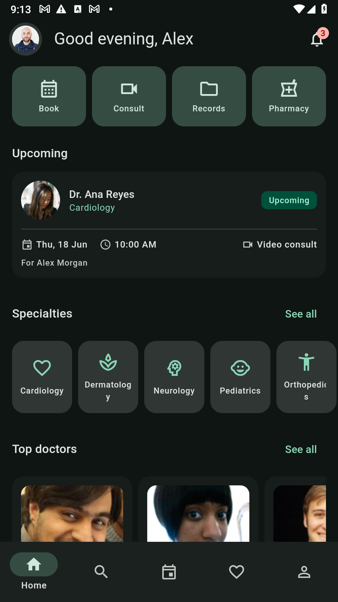
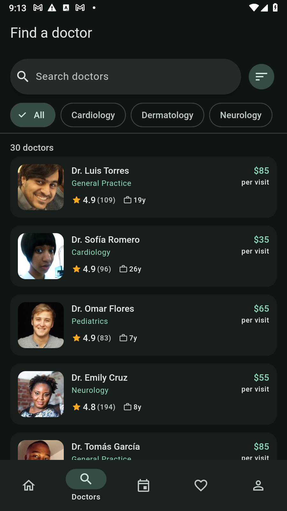
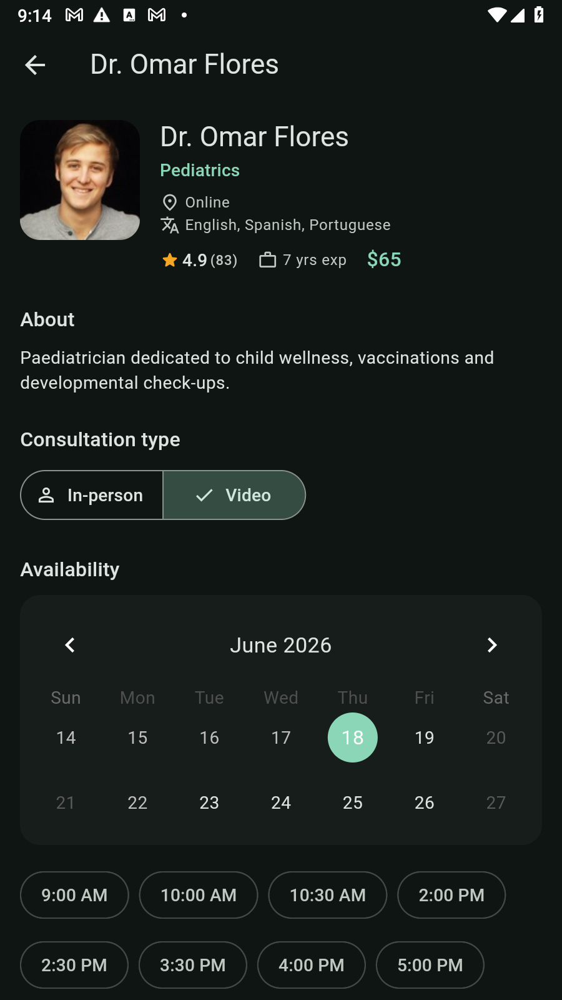
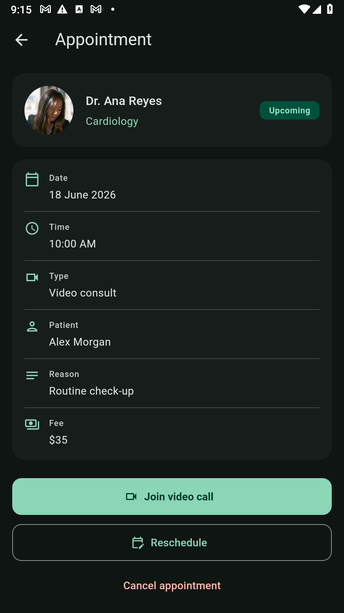
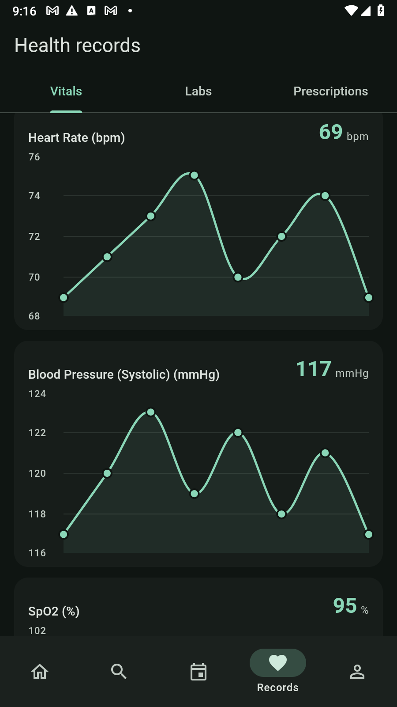

<div align="center">

# Curae

### A cross-platform telehealth & doctor-appointment app, built with Flutter

*From* cura *— care / cure.* Browse doctors, book in-person or video consultations,
manage appointments and family profiles, and review health records — from **one
codebase** running on **iOS, Android, Web, macOS, Windows, and Linux**.

Material 3 · Riverpod · go_router · Dio + Retrofit · a runnable mock REST API · real imagery only

</div>

> ⚠️ **Demo — not medical advice.** Curae is a demonstration built on **synthetic
> data**. It is not a medical device. Health articles/tips are generic and
> illustrative only. A disclaimer is shown in **Settings** and **About**.

---

## Screenshots

<div align="center">

| Home | Find a doctor | Doctor detail | Appointment | Health records |
|:---:|:---:|:---:|:---:|:---:|
|  |  |  |  |  |
| Greeting, quick actions, upcoming visit, specialties & top doctors | Search + specialty filters, sort, ratings & fees | Bio, in-person/video, availability calendar + slots | Status, details, join video / reschedule / cancel | Vitals trends (`fl_chart`), labs & prescriptions |

</div>

---

## About the project

Curae is a **production-quality reference app** for a patient-facing telehealth
product. It demonstrates how to structure a real Flutter codebase end to end:

- A **mock REST API** (`json-server`) seeded with realistic data, consumed
  through a proper **Dio → Retrofit → repository** stack — **no hardcoded data
  in the UI**. Every screen has explicit **loading, empty, and error** states.
- A **fully wired** core journey: *find a doctor → view availability → pick a
  slot → choose in-person/video, patient (self or family) and reason → confirm →
  it appears in My Appointments → reschedule / cancel.* Booking is **auth-gated**
  and **resumes after login**.
- **Material 3** design with a centralized theme + design-token system, light /
  dark / **dynamic color**, and a layout that **adapts** from phone to tablet to
  desktop (`NavigationBar` → `NavigationRail` → extended rail, with master–detail
  panes on wide screens).
- **Real images everywhere** — doctor/patient portraits from `randomuser.me` and
  medical/wellness photography from Unsplash, curated into the seed data.

### Feature tour

| Area | What it does |
|---|---|
| **Onboarding & auth** | Splash, 3-slide onboarding, login / register / forgot-password, and a **guest** mode for browsing |
| **Home** | Greeting, quick actions, next appointment, specialty shortcuts, top-rated doctors & health tips |
| **Find a doctor** | M3 `SearchBar`, specialty `FilterChip`s, sort by rating / fee / experience, paginated results |
| **Doctor detail** | Bio, languages, rating & reviews, fee, in-person/video toggle, `table_calendar` availability + slot chips |
| **Booking** | Slot → patient (self/family) → reason → review → confirm → success, with auth gating |
| **Appointments** | Upcoming / past, detail, **reschedule**, **cancel**, and a mock **video call** screen |
| **Health records** | Vitals trends with `fl_chart`, lab reports, and prescriptions |
| **Articles** | Health-tips list & reader with real imagery (generic, non-diagnostic copy) |
| **Family** | Add / edit / remove family profiles that flow into booking |
| **Account** | Profile, mock insurance card, settings (theme + language), about + disclaimer, logout |
| **Notifications** | Appointment reminders & confirmations with read/unread state |

---

## Tech stack

| Concern | Package |
|---|---|
| State management | `flutter_riverpod` (3.x) |
| Routing | `go_router` (shell route, deep links, auth redirect) |
| Networking | `dio` + `retrofit` |
| Models | `freezed` + `json_serializable` |
| Images | `cached_network_image` |
| UI helpers | `table_calendar`, `carousel_slider`, `shimmer`, `flutter_rating_bar`, `fl_chart` |
| Storage | `flutter_secure_storage` (token), `shared_preferences` (theme/locale) |
| i18n / formatting | `intl`, `flutter_localizations` |
| App icon | `flutter_launcher_icons` |

> Note on state: providers are written by hand (idiomatic `Notifier` /
> `AsyncNotifier` / `FutureProvider`) rather than `riverpod_generator`, to keep
> the codegen surface small and robust. All other codegen (`freezed`,
> `json_serializable`, `retrofit`) is used as specified.

## Architecture

Feature-first, layered. UI never talks to Dio directly — it goes through
repositories exposed as Riverpod providers.

```
lib/
  core/        # env config, theme + design tokens, dio client + interceptors,
               # router, storage, utils, providers (DI)
  data/        # freezed models, retrofit api client, query mapping, repositories
  features/
    auth/  onboarding/  splash/
    home/  doctors/  booking/  appointments/
    records/  articles/  family/  account/  notifications/
  shared/      # curae_image, state widgets, doctor/slot/appointment cards,
               # adaptive app shell
  app.dart  main.dart
mock-api/      # json-server: db.json, routes.json, server.js, generators
assets/icon/   # icon master + adaptive foreground + SVG source + generator
```

A Dio interceptor simulates **300–800 ms latency** and the occasional transient
GET failure (debug only) so the loading / error / retry states are genuinely
exercised.

---

## Getting started

### 1. Prerequisites

- Flutter **3.44+** (Dart 3.12+) — `flutter doctor`
- Node.js **18+** (for the mock API)
- Python **3.x** with **Pillow** (only to regenerate the icon / seed data)

On **Windows**, enable **Developer Mode** (`start ms-settings:developers`) so
Flutter can create the plugin symlinks needed for desktop/plugin builds.

### 2. Install

```bash
flutter pub get
dart run build_runner build --delete-conflicting-outputs   # freezed/json/retrofit
```

### 3. Run the mock API

```bash
cd mock-api
npm install
npm start            # http://localhost:3000  (auth + fresh availability + resources)
# or:  npm run db    # plain json-server (no /auth endpoints, static slots)
# or:  npm run seed  # re-generate db.json (real image URLs) via Python
```

`npm start` runs `server.js`, which wraps json-server to add the `/auth/*`
endpoints and regenerate doctor availability with **fresh future dates** on every
request, so the calendar never goes stale. CORS is enabled by default. The server
binds to all interfaces, so a physical device can reach it at your machine's LAN
IP (ensure your firewall allows inbound TCP **3000**).

**Seed data:** 1 user + 3 family members, 8 specialties, **30 doctors** (real
portraits), reviews, availability, **8 articles** (real Unsplash imagery), health
records (vitals/labs/prescriptions), sample appointments, and 6 notifications.

<details>
<summary><b>API endpoints</b></summary>

```
POST /auth/login            -> { token, user }
POST /auth/register         -> { token, user }
GET  /auth/me               -> { user }
GET  /specialties
GET  /doctors               ?specialtyId=&q=&rating_gte=&gender=&_sort=&_order=&_page=&_limit=
GET  /doctors/:id
GET  /doctors/:id/reviews
GET  /doctors/:id/slots     ?date=
GET/POST /appointments      ·  GET/PATCH /appointments/:id
GET  /records               -> { vitals, labs, prescriptions }
GET/POST /family-members    ·  PATCH/DELETE /family-members/:id
GET  /articles  ·  GET /articles/:id
GET  /notifications  ·  PATCH /notifications/:id
```
</details>

**Demo login:** the sign-in screen is pre-filled with `alex@curae.app` /
`password` — just tap **Sign in** (any email works; the demo returns the seeded
user). You can also browse doctors and articles **as a guest** — booking,
records, family and notifications require signing in.

### 4. Point the app at the API

Per-platform defaults work out of the box: `http://localhost:3000`, and
`http://10.0.2.2:3000` on the Android emulator. Override for a physical device:

```bash
flutter run --dart-define=CURAE_API_BASE_URL=http://192.168.1.50:3000
```

### 5. Run on each platform

```bash
flutter run -d chrome      # Web
flutter run -d windows     # Windows  (needs Developer Mode)
flutter run -d macos       # macOS
flutter run -d linux       # Linux
flutter run -d <android>   # Android emulator/device
flutter run -d <ios>       # iOS simulator/device (macOS host)
```

The same codebase runs on all six targets with no code changes.

### 6. App icon

Brand mark: a rounded-square, healing-green (`#006C51`) field with a white
rounded medical cross whose right arm tapers into a **pulse / ECG tick**. Source
lives in `assets/icon/` (`icon.svg`, `icon.png`, `foreground.png`).

```bash
python assets/icon/generate_icons.py     # optional — regenerate icon.png + foreground.png
dart run flutter_launcher_icons          # emit Android/iOS/web/Windows/macOS icons
```

### 7. Tests & analysis

```bash
flutter analyze            # zero warnings
flutter test               # slot/booking logic, filter→query mapping, mocked-Dio repo
```

---

## Imagery & licensing

- Portraits: `https://randomuser.me/api/portraits/{men|women}/{n}.jpg` (no key).
- Medical/wellness photos: **Unsplash** (`images.unsplash.com`), curated into
  `db.json`; all URLs were verified to return HTTP 200 before seeding.
- No `picsum` / placeholder generators are used anywhere.

## Branding

App name **Curae**; seed color `#006C51`; informational accent sky-blue. To
rename, change `pubspec.yaml` `name`, the app title in `app.dart`, the wordmark
in the splash/shell, the icon assets, and this README. (Alternates considered:
Docly, Medvia, Cura, Saluvia.)
